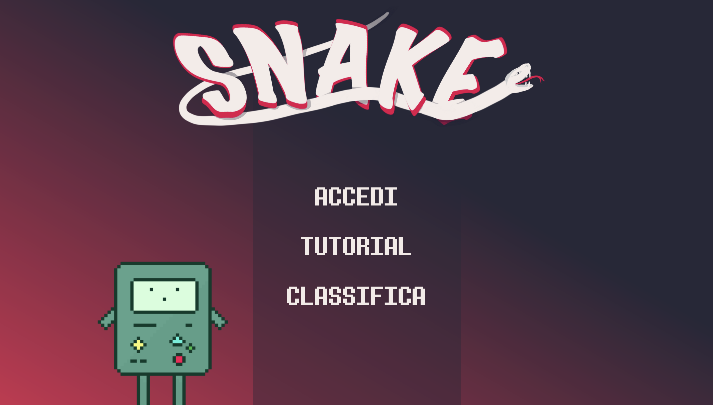
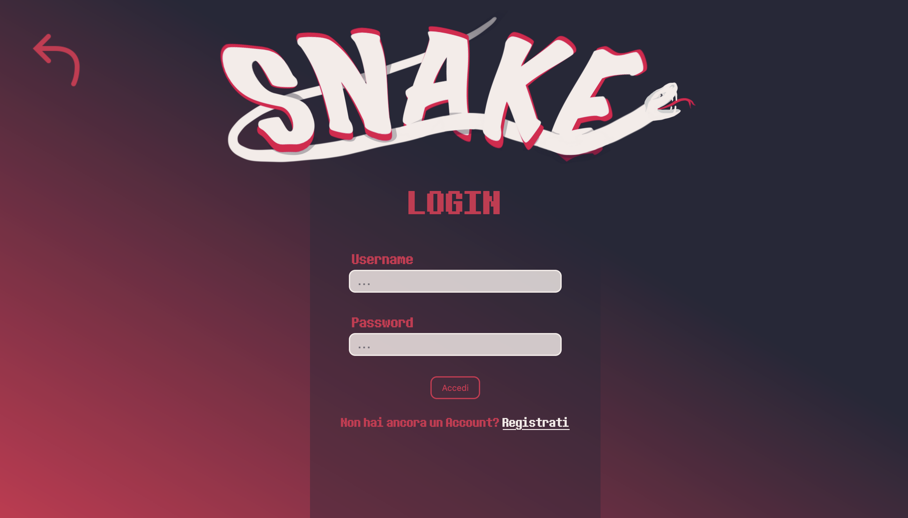
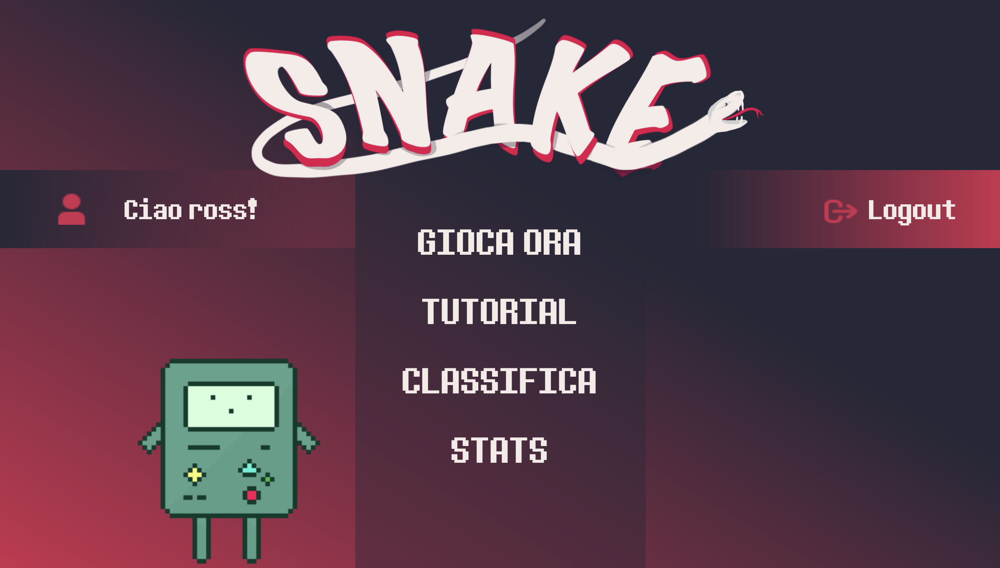
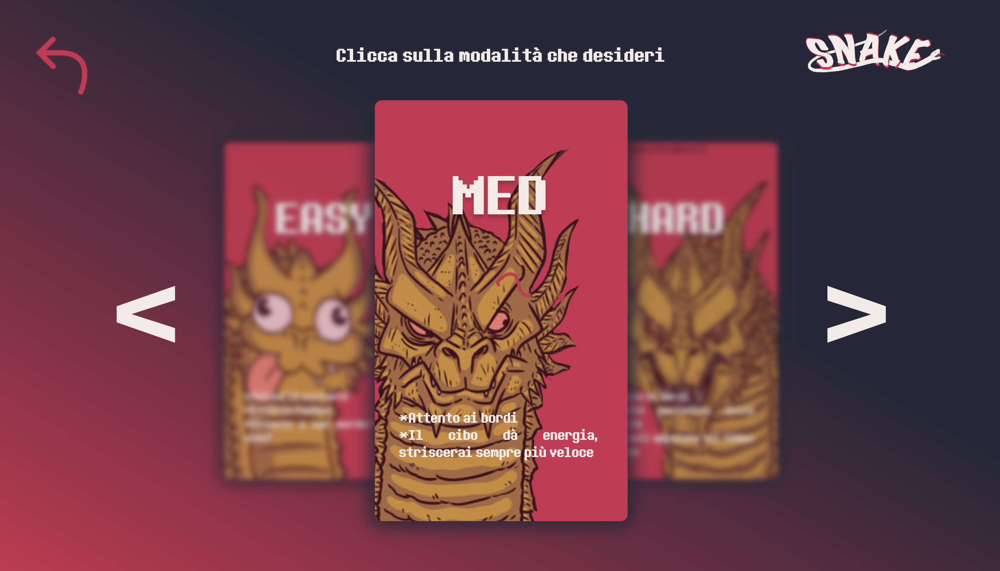
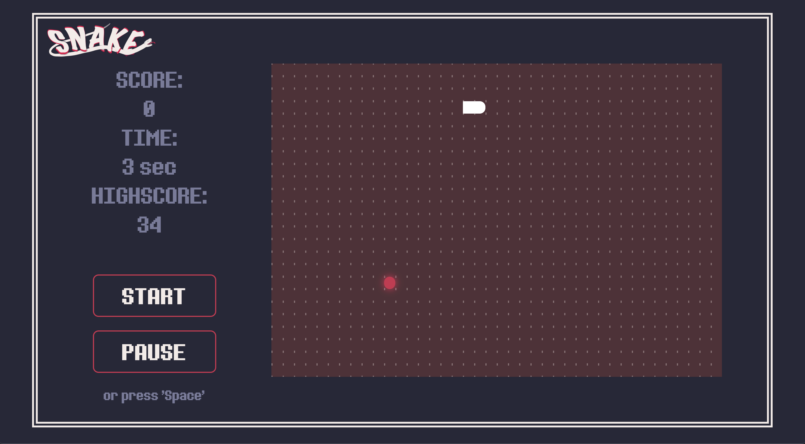
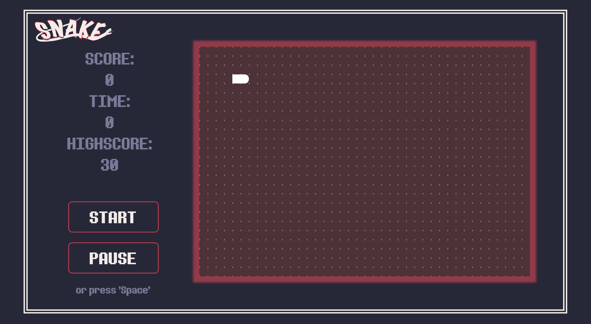
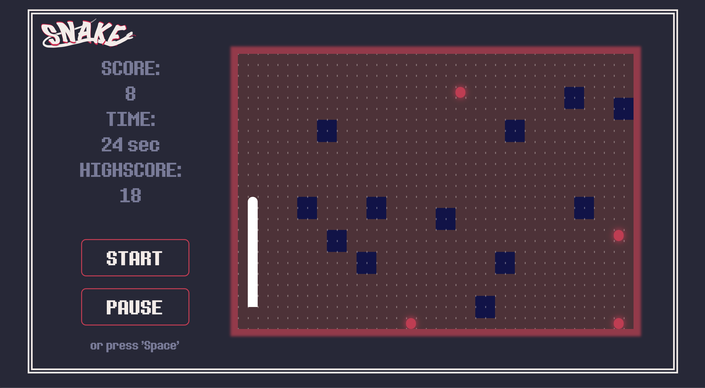
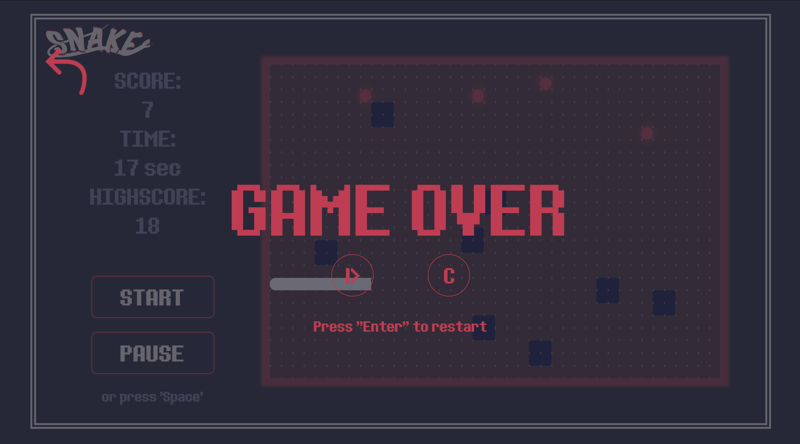

# Vanilla-SnakePJ

I completed the implementation of the classic game Snake as a project for a course focused on web development. This project encompassed both frontend and backend aspects of the game. Additionally, I dedicated considerable effort to crafting a visually appealing design inspired by a vintage aesthetic.

## Here a general view

  
  

  
   

  
  

  
  

