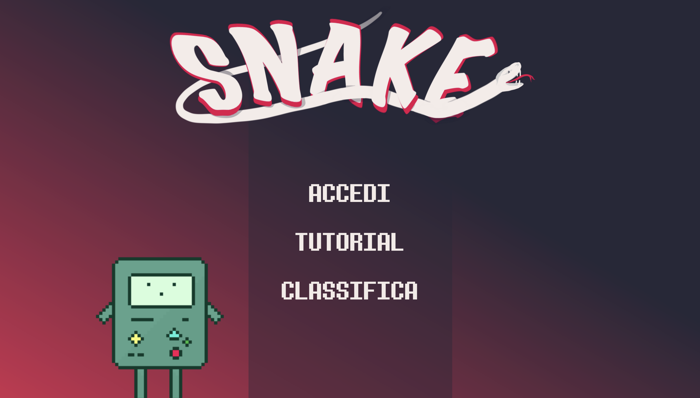
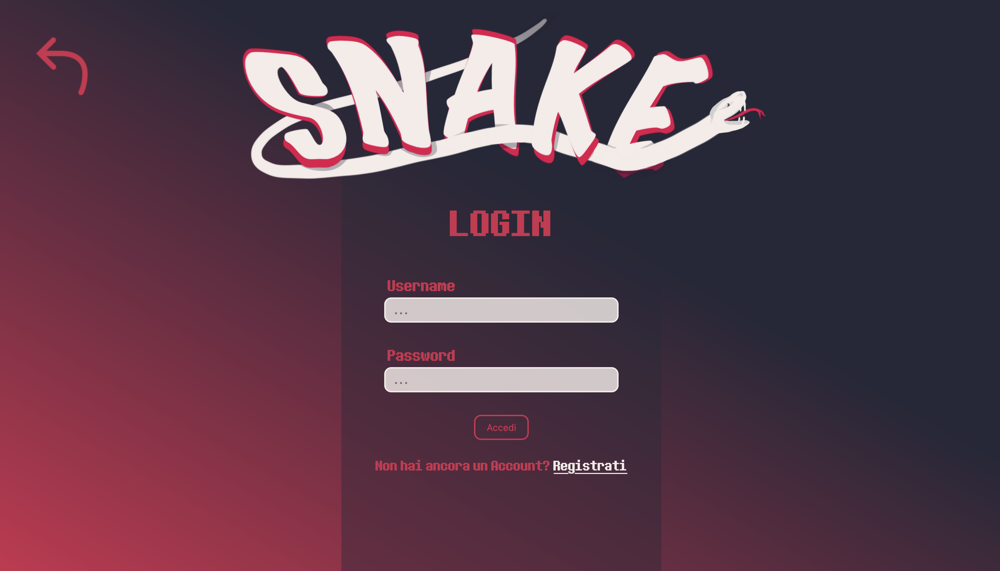
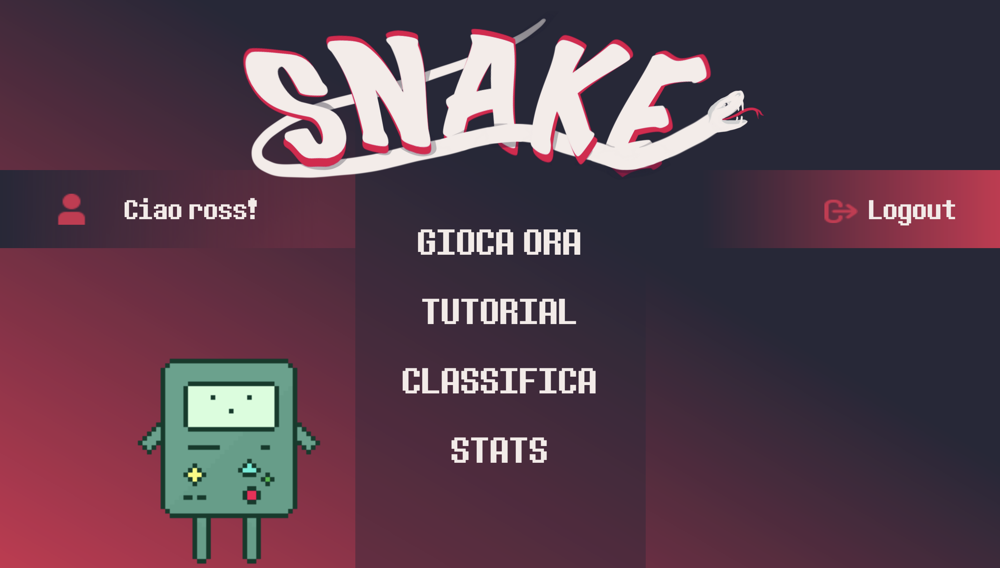
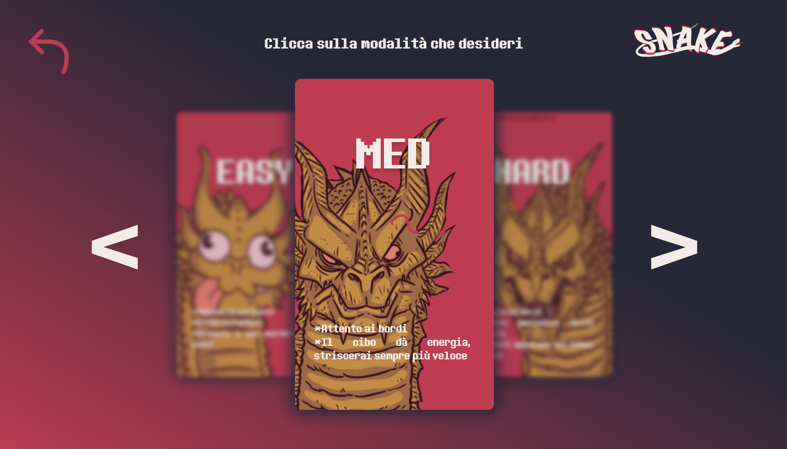
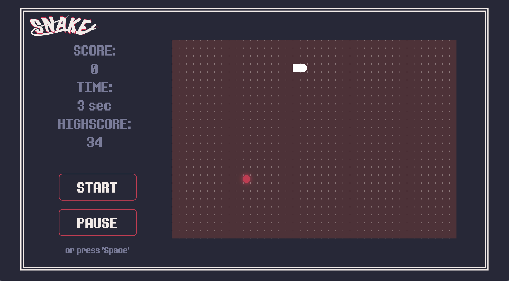
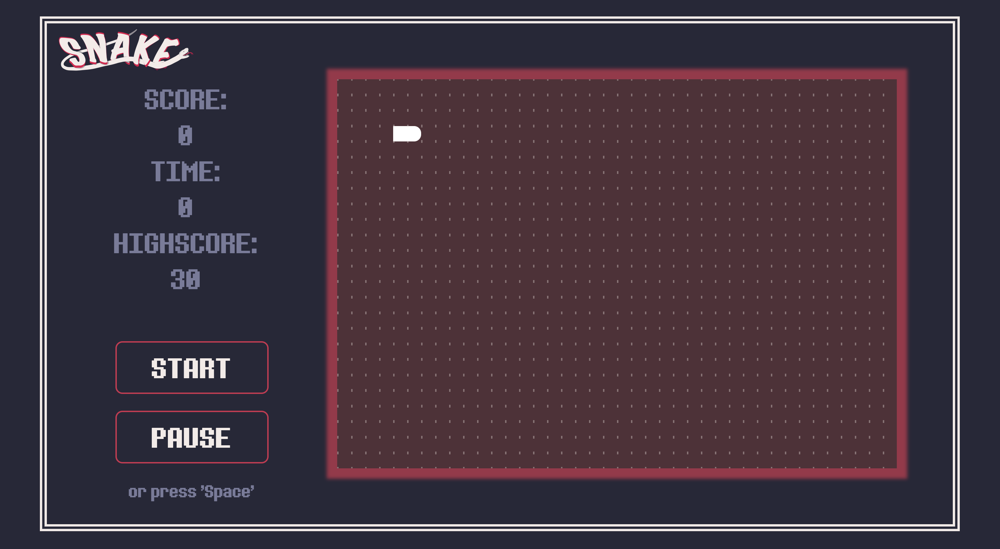
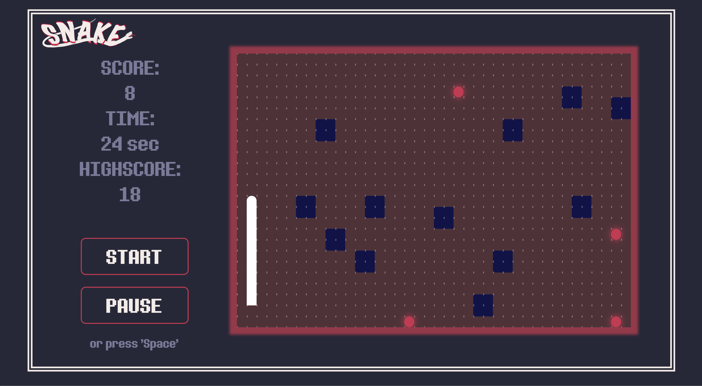
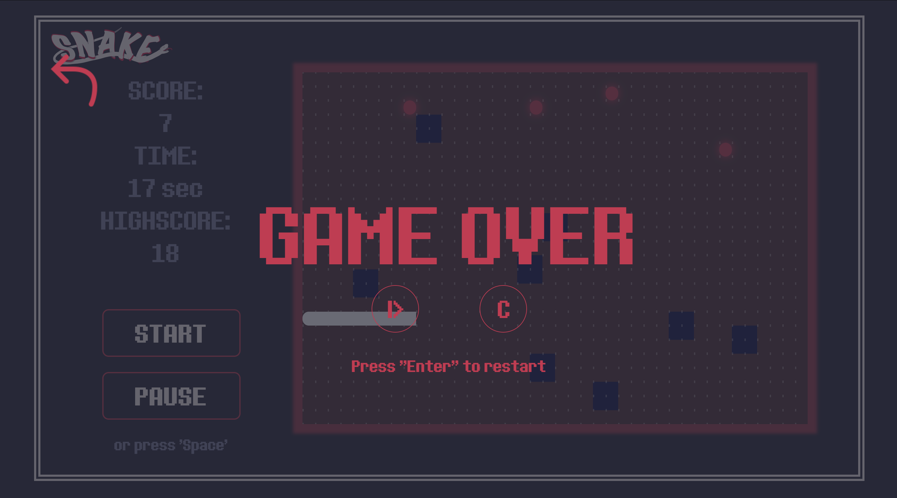

# Vanilla-SnakePJ

As part of a web development course project, I designed and implemented a complete version of the classic Snake game using HTML, CSS, and JavaScript. The project covers both the frontend logic and user interface, with a strong focus on delivering smooth gameplay and responsive interactions. Inspired by vintage arcade aesthetics, I also devoted special attention to the visual design to recreate a nostalgic yet modern feel.

## Here a general view

  
  

  
   

  
  

  
  

